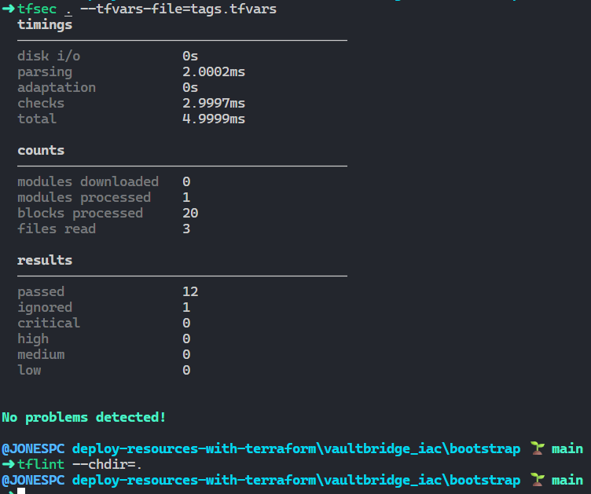
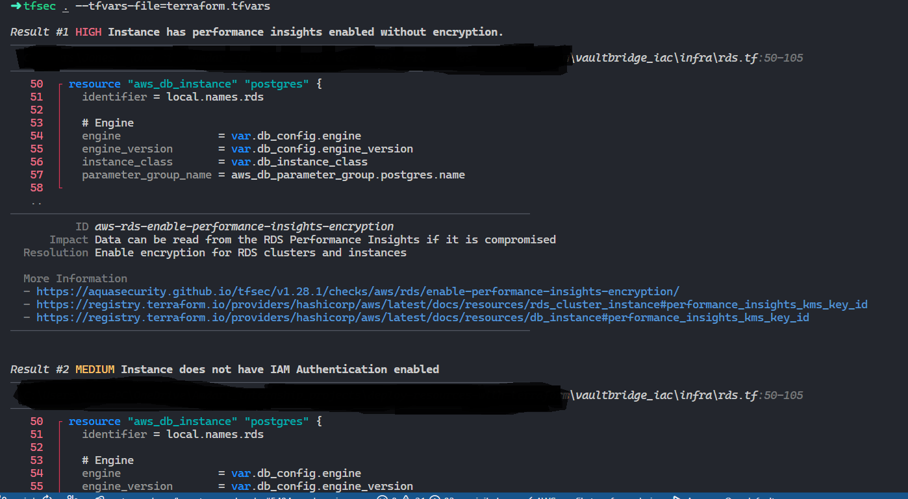
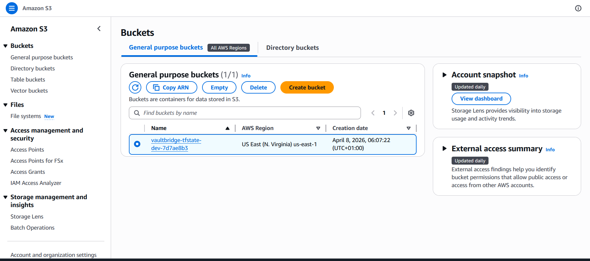
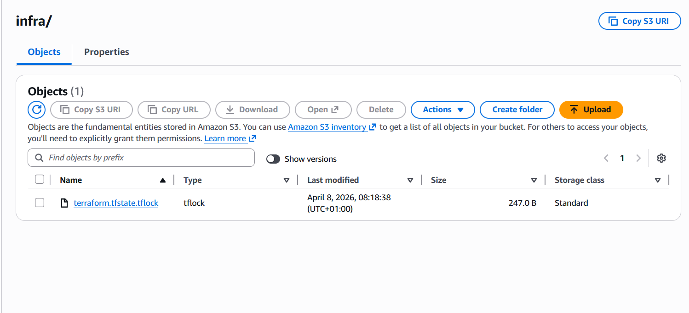
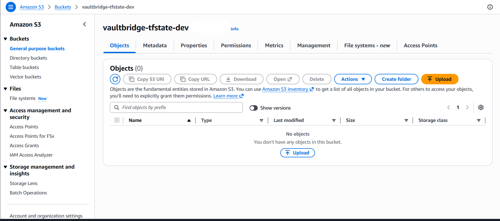
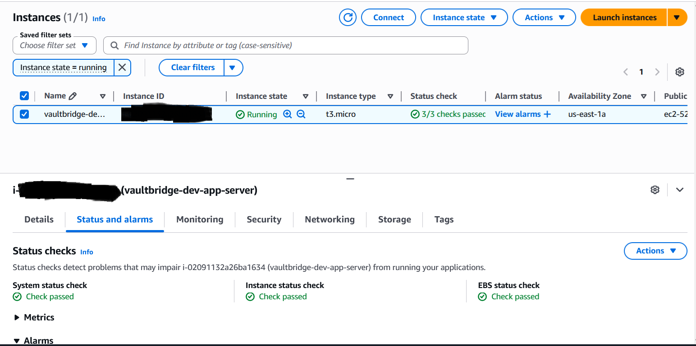
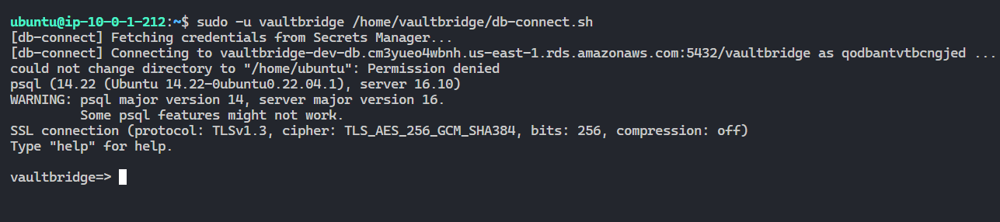

# VaultBridge Infrastructure as Code

Terraform project that provisions the VaultBridge AWS environment — VPC, EC2, and RDS — using a two-workspace pattern with remote state, S3-native locking, secrets management via AWS Secrets Manager, and network observability via VPC Flow Logs.

---

## Project Structure

```
vaultbridge_iac/
├── bootstrap/                  One-time setup. Creates the S3 bucket for remote state.
│   ├── main.tf
│   ├── variables.tf
│   ├── outputs.tf
│   ├── tags.tfvars
│   └── .gitignore
│
└── infra/                      Main infrastructure workspace.
    ├── backend.tf              Remote state configuration (S3 + lockfile)
    ├── providers.tf            AWS provider and version constraints
    ├── locals.tf               Centralised naming — all resource names derived here
    ├── variables.tf            Input variable declarations
    ├── main.tf                 Module orchestration (secrets + iam)
    ├── vpc.tf                  VPC, subnets, IGW, route tables, VPC Flow Logs
    ├── security_groups.tf      Firewall rules for EC2 and RDS
    ├── ec2.tf                  EC2 instance, Elastic IP, IAM instance profile, user_data
    ├── rds.tf                  RDS PostgreSQL, subnet group, parameter group
    ├── instID.tf               Dynamic AMI lookup (latest Ubuntu 22.04)
    ├── db_setup.sh             EC2 bootstrap script — installs psql client, creates vaultbridge OS user
    ├── outputs.tf              Post-apply reference values
    ├── .env.example            Runtime config template — safe to commit
    ├── .env                    Runtime config with real values — gitignored
    ├── terraform.tfvars.example
    ├── .gitignore
    │
    └── modules/
        ├── secrets/            AWS Secrets Manager — credentials + CMK encryption
        │   ├── main.tf
        │   ├── variables.tf
        │   └── outputs.tf
        │
        └── iam/                IAM roles for EC2, RDS Enhanced Monitoring, VPC Flow Logs
            ├── main.tf
            ├── variables.tf
            └── outputs.tf
```

---

## Architecture

```
Internet
    │
    ▼
Internet Gateway
    │
Public Subnets  (us-east-1a, us-east-1b)  →  EC2 + Elastic IP
Private Subnets (us-east-1a, us-east-1b)  →  RDS PostgreSQL

VPC Flow Logs  →  CloudWatch Log Group (encrypted, 30-day retention)
```

Private subnets have no route to the internet gateway. The database cannot be reached from the internet regardless of security group configuration — this is an architectural constraint, not a policy.

---

## Prerequisites

- Terraform >= 1.5.0
- AWS CLI v2, configured with credentials (`aws configure`)
- An EC2 key pair created in your target AWS region (see First-Time Setup)
- tfsec ([install guide](https://aquasecurity.github.io/tfsec))
- tflint ([install guide](https://github.com/terraform-linters/tflint))

---

## How Credentials Work

DB credentials are never typed by a human, stored in a file, or passed on the command line.

RDS native rotation (`manage_master_user_password = true`) is used. AWS generates the master username, stores the credentials as a JSON secret in Secrets Manager encrypted with the project CMK, and rotates the password automatically on schedule — no Lambda function required, no rotation code to maintain.

The flow is:

1. On `terraform apply`, RDS generates the master credentials and stores them in a Secrets Manager secret encrypted with the project CMK.
2. AWS rotates the password automatically. The application always fetches the current value at runtime via `GetSecretValue` — it never holds a stale credential.
3. The EC2 instance role is granted `GetSecretValue` scoped to the exact secret ARN. The ARN is the only thing stored in `.env`.

The `secrets` module's sole responsibility is provisioning the KMS CMK. It no longer generates or stores any credentials.

---

## VPC Flow Logs

All IP traffic in and out of the VPC is captured and published to a CloudWatch Log Group (`/aws/vpc/vaultbridge-dev-flow-logs`). This provides:

- Full audit trail of accepted and rejected network connections
- Source/destination IP, port, protocol, and action for every flow
- 30-day retention, encrypted with the same CMK as Secrets Manager

The IAM role that grants VPC permission to write to CloudWatch is managed in `modules/iam`. Log group encryption uses the project CMK — the key policy explicitly grants `logs.<region>.amazonaws.com` the required `kms:Encrypt`, `kms:Decrypt`, and `kms:GenerateDataKey` permissions.

---

## EC2 Bootstrap — db_setup.sh

When the EC2 instance first boots, `user_data` runs `db_setup.sh` via cloud-init. It:

1. Installs `postgresql-client`, `jq`, and AWS CLI v2
2. Creates a non-root OS user `vaultbridge` (no sudo, restricted home directory)
3. Writes `/home/vaultbridge/db-connect.sh` — a helper that fetches live credentials from Secrets Manager and opens a `psql` session with `sslmode=require`

To connect to the database from the EC2 instance:
```bash
sudo -u vaultbridge /home/vaultbridge/db-connect.sh
```

Credentials are fetched fresh on every invocation via the EC2 instance role. They are never written to disk.

---

## First-Time Setup

### 1. Create an EC2 key pair

Terraform references an existing key pair by name — it does not create one. Generate it locally and import the public key to AWS:

```bash
ssh-keygen -t ed25519 -C "vaultbridge-dev" -f ~/.ssh/vaultbridge_dev

aws ec2 import-key-pair \
  --key-name "vaultbridge-dev" \
  --public-key-material fileb://~/.ssh/vaultbridge_dev.pub \
  --region us-east-1
```

Verify it exists:
```bash
aws ec2 describe-key-pairs --key-names "vaultbridge-dev" --region us-east-1
```

### 2. Deploy the bootstrap workspace

The bootstrap workspace runs once with local state to create the S3 bucket used by the main workspace.

```bash
cd vaultbridge_iac/bootstrap
terraform fmt -recursive
terraform init
terraform validate
terraform plan -var-file="tags.tfvars"
terraform apply -var-file="tags.tfvars"
```

Note the `state_bucket_name` output. You will need it in the next step.

### 3. Configure the remote backend

Open `vaultbridge_iac/infra/backend.tf` and replace the bucket placeholder with the output from step 2:

```hcl
terraform {
  backend "s3" {
    bucket       = "vaultbridge-tfstate-dev-<your-suffix>"
    key          = "infra/terraform.tfstate"
    region       = "us-east-1"
    encrypt      = true
    use_lockfile = true
  }
}
```

### 4. Configure your operator IP

SSH access is locked to your IP only — port 22 is never open to `0.0.0.0/0`.

```bash
cd vaultbridge_iac/infra
cp .env.example .env
```

Edit `.env` and set `MY_IP` to your current public IP in CIDR notation:

```bash
# Find your IP
curl -s ifconfig.me

# Set it in .env
MY_IP=203.0.113.5/32
```

Then sync it into `terraform.tfvars`:

```bash
source .env && sed -i "s|allowed_ssh_cidr.*|allowed_ssh_cidr = \"$MY_IP\"|" terraform.tfvars
```

If your IP changes (different network, VPN, etc.), update `MY_IP` in `.env`, re-run the sync, and run `terraform apply`. The security group rule updates in place.

### 5. Configure variable values

```bash
cp terraform.tfvars.example terraform.tfvars
```

Edit `terraform.tfvars` and fill in:
- `key_pair_name` — the key pair name from step 1 (e.g. `vaultbridge-dev`)
- `allowed_ssh_cidr` — already set if you ran the sync command above

No `db_username` or `db_password` variables exist. Credentials are generated and managed entirely by the `secrets` module.

---

## Static Analysis and Security Scanning

Two tools run before every `terraform plan`. Neither is optional.

### tfsec

tfsec scans Terraform code for security misconfigurations — things that would pass `terraform validate` but fail a security audit or expose infrastructure to attack.

What it catches in this project:
- Security groups open to `0.0.0.0/0` on sensitive ports
- Unencrypted EBS volumes or RDS storage
- S3 buckets with public access enabled
- EC2 instances without IMDSv2 enforced
- RDS instances with a public endpoint
- Missing encryption in transit (SSL not enforced)
- CloudWatch log groups without CMK encryption
- VPC without flow logs enabled

Configuration: `vaultbridge_iac/.tfsec/config.yml`

```bash
tfsec ./infra --tfvars-file=terraform.tfvars
tfsec ./infra --minimum-severity HIGH
tfsec ./infra --format json > tfsec-results.json
```

Any finding at MEDIUM severity or above fails the pipeline. Exclusions are documented with a written justification in `.tfsec/config.yml`.

---

### tflint

tflint catches correctness issues that tfsec does not cover. It validates Terraform code against the actual AWS API, not just HCL syntax.

What it catches in this project:
- Invalid EC2 instance types (`t3.mciro` passes `terraform validate`, fails tflint)
- Invalid RDS instance classes
- Deprecated resource types and arguments
- Variables declared without descriptions
- Missing `required_providers` entries

Configuration: `vaultbridge_iac/.tflint.hcl`

```bash
tflint --init                          # run once after cloning
tflint --chdir=infra
tflint --chdir=bootstrap
tflint --chdir=infra --format compact  # CI-friendly
```

---

### How the two tools relate

| Tool | Catches | Does not catch |
|---|---|---|
| tfsec | Security misconfigurations | Invalid AWS resource values |
| tflint | Invalid AWS values, deprecated syntax | Runtime security issues |
| terraform validate | HCL syntax errors | Either of the above |

---

## Deployment Workflow

Every infrastructure change follows this sequence without exception.

```bash
cd vaultbridge_iac/infra

# 0. Sync your IP into terraform.tfvars if it has changed
source .env && sed -i "s|allowed_ssh_cidr.*|allowed_ssh_cidr = \"$MY_IP\"|" terraform.tfvars

# 1. Format
terraform fmt -recursive

# 2. Lint
tflint --chdir=.

# 3. Security scan
tfsec . --tfvars-file=terraform.tfvars

# 4. Validate
terraform validate

# 5. Plan
terraform plan -out=tfplan

# 6. Apply the reviewed plan
terraform apply tfplan

# 7. Verify
terraform output
```

After apply, copy outputs into `.env`:

```bash
terraform output db_secret_arn   # → DB_SECRET_ARN in .env
terraform output rds_endpoint    # → DB_HOST in .env (host portion only, strip :5432)
```

---

## tfsec Scan Results

Bootstrap workspace (clean after KMS fix):

```
passed    12  |  ignored  1  |  critical  0  |  high  0  |  medium  0  |  low  0
No problems detected!
```



Infra workspace (clean after all fixes):

```
passed    33  |  ignored  0  |  critical  0  |  high  0  |  medium  0  |  low  0
No problems detected!
```

---

## State Management

| Concern | Implementation |
|---|---|
| Remote state storage | S3 bucket with versioning and CMK encryption |
| Concurrent apply protection | S3-native locking via `use_lockfile = true` |
| State access | Any engineer with the correct IAM permissions can run plan/apply |

DynamoDB-based locking is not used — deprecated in recent Terraform versions, removed in favour of S3-native locking.

---

## Security Controls

| Control | Detail |
|---|---|
| DB credentials | RDS native rotation (`manage_master_user_password = true`) — AWS generates, stores, and rotates credentials in Secrets Manager automatically. No Lambda required. Never typed or stored in a file |
| Secret encryption | Customer-managed KMS key (CMK) with annual rotation |
| KMS key policy | Explicitly grants Secrets Manager, CloudWatch Logs, and RDS the minimum required actions — no wildcards |
| SSH access | Restricted to `MY_IP` from `.env` via `allowed_ssh_cidr` — never `0.0.0.0/0` |
| RDS network access | Security group reference from EC2 SG only — no public endpoint |
| EC2 metadata | IMDSv2 enforced (`http_tokens = required`) — blocks SSRF credential theft |
| EC2 IAM role | Least-privilege: `GetSecretValue` scoped to exact secret ARN + SSM Session Manager |
| EC2 OS user | Non-root `vaultbridge` user owns all DB operations — no sudo rights |
| RDS IAM authentication | `iam_database_authentication_enabled = true` — IAM token auth as second layer |
| RDS Enhanced Monitoring | Dedicated IAM role — OS-level metrics every 60 seconds |
| RDS Performance Insights | Encrypted with the project CMK |
| Storage encryption | EBS root volume and RDS storage encrypted at rest |
| RDS SSL | `rds.force_ssl = 1` in parameter group — all connections must use TLS |
| VPC Flow Logs | All traffic captured to CloudWatch — encrypted with CMK, 30-day retention |
| Flow Logs IAM | Scoped to exact log group ARN — no wildcard resources |
| S3 state bucket | Public access blocked, versioning enabled, CMK encryption |
| tfsec | Scans for security misconfigurations before every apply — fails on MEDIUM+ |
| tflint | Validates AWS resource values and catches deprecated syntax |

---

## Resource Naming

All resource names are derived from `locals.tf` using the pattern `${var.project_name}-${var.environment}-<resource>`. Changing `project_name` or `environment` in `terraform.tfvars` renames every resource consistently.

---

## Outputs

```bash
terraform output                  # all outputs
terraform output ec2_public_ip
terraform output ec2_ssh_command  # ready-to-use SSH command
terraform output rds_endpoint
terraform output db_secret_arn    # copy into .env → DB_SECRET_ARN
terraform output db_secret_name
terraform output ec2_iam_role_arn
```

---

## Environment Parity

The same codebase deploys to dev, staging, or prod by changing variable values. Create a separate `terraform.tfvars` per environment with `environment = "staging"`. Secrets Manager creates a separate secret per environment at `vaultbridge/<environment>/db-credentials` with independent IAM access policies.

---

## What is Not Included

This project covers foundational infrastructure. The following are out of scope and would be added for a production migration:

- NAT Gateway — required if private subnet resources need outbound internet access (e.g. RDS pulling OS patches)
- Application Load Balancer — for distributing traffic across multiple EC2 instances
- Auto Scaling Group — for horizontal scaling and self-healing compute
- CloudWatch alarms — metric-based alerting on CPU, memory, RDS connections, and flow log anomalies
- CloudWatch log groups for application logs — currently only VPC flow logs are captured; EC2 application and system logs require the CloudWatch agent configured separately
- Route 53 DNS records — for a stable hostname pointing to the Elastic IP
- ACM certificates — for HTTPS termination at the load balancer
- Multi-AZ RDS — `multi_az = true` for automatic failover in production
- RDS deletion protection — set `deletion_protection = true` in `terraform.tfvars` for staging and prod

---

## Project Structure

```
vaultbridge_iac/
├── bootstrap/                  One-time setup. Creates the S3 bucket for remote state.
│   ├── main.tf
│   ├── variables.tf
│   ├── outputs.tf
│   ├── tags.tfvars
│   └── .gitignore
│
└── infra/                      Main infrastructure workspace.
    ├── backend.tf              Remote state configuration (S3 + lockfile)
    ├── providers.tf            AWS provider and version constraints
    ├── locals.tf               Centralised naming — all resource names derived here
    ├── variables.tf            Input variable declarations
    ├── main.tf                 Module orchestration (secrets + iam)
    ├── vpc.tf                  VPC, subnets, internet gateway, route tables
    ├── security_groups.tf      Firewall rules for EC2 and RDS
    ├── ec2.tf                  EC2 instance, Elastic IP, IAM instance profile
    ├── rds.tf                  RDS PostgreSQL, subnet group, parameter group
    ├── instID.tf               Dynamic AMI lookup (latest Ubuntu 22.04)
    ├── outputs.tf              Post-apply reference values
    ├── .env.example            Runtime config template — safe to commit
    ├── .env                    Runtime config with real values — gitignored
    ├── terraform.tfvars.example
    ├── .gitignore
    │
    └── modules/
        ├── secrets/            AWS Secrets Manager — credentials + KMS + rotation
        │   ├── main.tf
        │   ├── variables.tf
        │   └── outputs.tf
        │
        └── iam/                IAM roles for EC2 (Secrets Manager access) and RDS (Enhanced Monitoring)
            ├── main.tf
            ├── variables.tf
            └── outputs.tf
```

---

## Architecture

```
Internet
    │
    ▼
Internet Gateway
    │
Public Subnets  (us-east-1a, us-east-1b)  →  EC2 + Elastic IP
Private Subnets (us-east-1a, us-east-1b)  →  RDS PostgreSQL
```

Private subnets have no route to the internet gateway. The database cannot be reached from the internet regardless of security group configuration — this is an architectural constraint, not a policy.

---

## Prerequisites

- Terraform >= 1.5.0
- AWS CLI v2, configured with credentials (`aws configure`)
- tfsec ([install guide](https://aquasecurity.github.io/tfsec))
- tflint ([install guide](https://github.com/terraform-linters/tflint))
- An EC2 key pair created in your target AWS region

---

## How Credentials Work

DB credentials are never typed by a human, stored in a file, or passed on the command line.

RDS native rotation (`manage_master_user_password = true`) is used. AWS generates the master username, stores the credentials as a JSON secret in Secrets Manager encrypted with the project CMK, and rotates the password automatically on schedule — no Lambda function required, no rotation code to maintain.

The flow is:

1. On `terraform apply`, RDS generates the master credentials and stores them in a Secrets Manager secret encrypted with the project CMK.
2. AWS rotates the password automatically. The application always fetches the current value at runtime via `GetSecretValue` — it never holds a stale credential.
3. The EC2 instance role is granted `GetSecretValue` scoped to the exact secret ARN. The ARN is the only thing stored in `.env`.

The `secrets` module's sole responsibility is provisioning the KMS CMK. It no longer generates or stores any credentials.

---

## First-Time Setup

### 1. Deploy the bootstrap workspace

The bootstrap workspace runs once with local state to create the S3 bucket used by the main workspace.

```bash
cd vaultbridge_iac/bootstrap
terraform fmt -recursive
terraform init
terraform validate
terraform plan -var-file="tags.tfvars"
terraform apply -var-file="tags.tfvars"
```

Note the `state_bucket_name` output. You will need it in the next step.

### 2. Configure the remote backend

Open `vaultbridge_iac/infra/backend.tf` and replace the bucket placeholder with the output from step 1:

```hcl
terraform {
  backend "s3" {
    bucket       = "vaultbridge-tfstate-dev-<your-suffix>"
    key          = "infra/terraform.tfstate"
    region       = "us-east-1"
    encrypt      = true
    use_lockfile = true
  }
}
```

### 3. Configure your operator IP

SSH access is locked to your IP only — port 22 is never open to `0.0.0.0/0`.

```bash
cd vaultbridge_iac/infra
cp .env.example .env
```

Edit `.env` and set `MY_IP` to your current public IP in CIDR notation:

```bash
# Find your IP
curl -s ifconfig.me

# Set it in .env
MY_IP=203.0.113.5/32
```

Then sync it into `terraform.tfvars`:

```bash
source .env && sed -i "s|allowed_ssh_cidr.*|allowed_ssh_cidr = \"$MY_IP\"|" terraform.tfvars
```

If your IP changes (different network, VPN, etc.), update `MY_IP` in `.env` and re-run the sync + `terraform apply`. The security group rule updates in place.

### 4. Configure variable values

```bash
cp terraform.tfvars.example terraform.tfvars
```

Edit `terraform.tfvars` and fill in:
- `key_pair_name` — name of your existing EC2 key pair
- `allowed_ssh_cidr` — already set if you ran the sync command above

No `db_username` or `db_password` variables exist. Credentials are generated and managed entirely by the `secrets` module.

---

## Static Analysis and Security Scanning

Two tools run before every `terraform plan`. Neither is optional.

### tfsec

tfsec scans Terraform code for security misconfigurations — things that would pass `terraform validate` but fail a security audit or expose infrastructure to attack.

What it catches in this project:
- Security groups open to `0.0.0.0/0` on sensitive ports
- Unencrypted EBS volumes or RDS storage
- S3 buckets with public access enabled
- EC2 instances without IMDSv2 enforced
- RDS instances with a public endpoint
- Missing encryption in transit (SSL not enforced)

Configuration: `vaultbridge_iac/.tfsec/config.yml`

```bash
# Scan the infra workspace
tfsec ./infra

# Human-readable output
tfsec ./infra --format lovely

# Only surface HIGH and CRITICAL findings
tfsec ./infra --minimum-severity HIGH

# JSON output for CI pipelines
tfsec ./infra --format json > tfsec-results.json
```

Any finding at MEDIUM severity or above fails the pipeline. Exclusions are documented with a written justification in `.tfsec/config.yml` — no rule is silenced without a reason on record.

---

### tflint

tflint catches correctness issues that tfsec does not cover. It validates Terraform code against the actual AWS API, not just HCL syntax.

What it catches in this project:

- Invalid EC2 instance types (`t3.mciro` passes `terraform validate`, fails tflint)
- Invalid RDS instance classes
- Deprecated resource types and arguments
- Variables declared without descriptions
- Unused variable declarations
- Missing `required_providers` entries

Configuration: `vaultbridge_iac/.tflint.hcl`

```bash
# Download plugins declared in .tflint.hcl (run once after cloning)
tflint --init

# Lint the infra workspace
tflint --chdir=infra

# Lint the bootstrap workspace
tflint --chdir=bootstrap

# Compact output for CI
tflint --chdir=infra --format compact
```

---

### How the two tools relate

| Tool | Catches | Does not catch |
|---|---|---|
| tfsec | Security misconfigurations | Invalid AWS resource values |
| tflint | Invalid AWS values, deprecated syntax | Runtime security issues |
| terraform validate | HCL syntax errors | Either of the above |

All three run in sequence before any plan is reviewed or applied.

---

## Deployment Workflow

Every infrastructure change follows this sequence without exception.

```bash
cd vaultbridge_iac/infra

# 0. Sync your IP into terraform.tfvars if it has changed
source .env && sed -i "s|allowed_ssh_cidr.*|allowed_ssh_cidr = \"$MY_IP\"|" terraform.tfvars

# 1. Format
terraform fmt -recursive

# 2. Lint — catch invalid AWS values and deprecated syntax
tflint --chdir=.

# 3. Security scan — catch misconfigurations before they reach AWS
tfsec . --tfvars-file=terraform.tfvars

# 4. Validate
terraform validate

# 5. Plan — review every change before applying
terraform plan -out=tfplan

# 6. Apply the reviewed plan
terraform apply tfplan

# 7. Verify
terraform output
```

After apply, copy the secret ARN and RDS endpoint into `.env`:

```bash
terraform output db_secret_arn   # → DB_SECRET_ARN in .env
terraform output rds_endpoint    # → DB_HOST in .env (host portion only)
```

These issues were caught by `tfsec` in the `infra` workspace:

```sh
tfsec . --tfvars-file=terraform.tfvars
```

**Output**:

```hcl
  results
  ──────────────────────────────────────────
  passed               21
  ignored              0
  critical             0
  high                 1
  medium               3
  low                  0

  21 passed, 4 potential problem(s) detected.
```




All issues resolved:

```hcl
tfsec . --tfvars-file=terraform.tfvars
```

**Output**:

```hcl
  counts
  ──────────────────────────────────────────
  modules downloaded   0
  modules processed    3
  blocks processed     111
  files read           17

  results
  ──────────────────────────────────────────
  passed               33
  ignored              0
  critical             0
  high                 0
  medium               0
  low                  0


No problems detected!
```

Infra workspace's configurations are now valid, secure  and ready to deploy.

```hcl
terraform validate
```

**Output**:

```hcl
Success! The configuration is valid.
```

Plan and apply the changes to deploy the infrastructure.

```hcl
terraform plan -var-file="terraform.tfvars"
```

**Output**:

```hcl
Plan: 42 to add, 0 to change, 0 to destroy.
```

```hcl
Apply complete! Resources: 42 added, 0 changed, 0 destroyed.
```









---

## State Management

| Concern | Implementation |
|---|---|
| Remote state storage | S3 bucket with versioning and KMS encryption |
| Concurrent apply protection | S3-native locking via `use_lockfile = true` |
| State access | Any engineer with the correct IAM permissions can run plan/apply |

DynamoDB-based locking is not used. It is deprecated in recent Terraform versions and has been removed in favour of S3-native locking.


---

## Security Controls

| Control | Detail |
|---|---|
| DB credentials | RDS native rotation (`manage_master_user_password = true`) — AWS generates, stores, and rotates credentials in Secrets Manager automatically. No Lambda required. Never typed or stored in a file |
| Secret encryption | Customer-managed KMS key (CMK) with annual rotation |
| SSH access | Restricted to `MY_IP` from `.env` via `allowed_ssh_cidr` — never `0.0.0.0/0` |
| RDS network access | Security group reference from EC2 SG only — no public endpoint |
| EC2 metadata | IMDSv2 enforced (`http_tokens = required`) — blocks SSRF credential theft |
| EC2 IAM role | Least-privilege: `GetSecretValue` on the specific secret ARN only + SSM Session Manager |
| RDS Enhanced Monitoring | Dedicated IAM role — OS-level metrics every 60 seconds |
| Storage encryption | EBS root volume and RDS storage encrypted at rest |
| RDS SSL | `rds.force_ssl = 1` in parameter group — all connections must use TLS |
| S3 state bucket | Public access blocked, versioning enabled, CMK encryption |
| tfsec | Scans for security misconfigurations before every apply — fails on MEDIUM+ |
| tflint | Validates AWS resource values and catches deprecated syntax before every apply |

---

## Resource Naming

All resource names are derived from a single `locals.tf` file using the pattern `${var.project_name}-${var.environment}-<resource>`. Changing `project_name` or `environment` in `terraform.tfvars` renames every resource consistently.

---

## Outputs

After `terraform apply`, retrieve values with:

```bash
terraform output                  # all outputs
terraform output ec2_public_ip
terraform output rds_endpoint
terraform output ec2_ssh_command
terraform output db_secret_arn    # copy into .env → DB_SECRET_ARN
terraform output db_secret_name
```

---

## Environment Parity

The same codebase deploys to dev, staging, or prod by changing variable values. Create a separate `terraform.tfvars` per environment with the appropriate `environment = "staging"` value. Secrets Manager creates a separate secret per environment at path `vaultbridge/<environment>/db-credentials` with independent rotation schedules and IAM access policies.

---

## tfsec Scan Results (bootstrap workspace)

Running `tfsec` in the `bootstrap` workspace after the KMS fix:

```bash
tfsec . --tfvars-file=tags.tfvars
```

Output:

```
 results
  ──────────────────────────────────────────
  passed               12
  ignored              1
  critical             0
  high                 0
  medium               0
  low                  0

No problems detected!
```


---

## What is Not Included

This project covers foundational infrastructure. The following are out of scope and would be added for a production migration:

- NAT Gateway (required if private subnet resources need outbound internet access)
- Application Load Balancer
- Auto Scaling Group
- CloudWatch alarms and log groups
- Route 53 DNS records
- ACM certificates
## SSH Access && Connected RDS Instance

Having deployed the infracture, I have successfully SSHed into the EC2 instance and connected to the RDS PostgreSQL database using the `db-connect.sh` helper script, which retrieves credentials securely from Secrets Manager at runtime. The connection is encrypted with SSL, and I can run SQL queries against the database from the EC2 instance.



I am already connected via `SSL (TLSv1.3, AES_256_GCM)`, so encryption in transit is confirmed.

Some Connected Queries:

1. Check PostgreSQL version and connection info:
  
```sql
SELECT version();
\conninfo
```

**Output**:

```sql
PostgreSQL 16.10 on x86_64-pc-linux-gnu, compiled by gcc (GCC) 7.3.1 20180712 (Red Hat 7.3.1-17), 64-bit       
(1 row)
```

2. Check active connections:

```sql
SELECT count(*), state FROM pg_stat_activity GROUP BY state;
SELECT pid, usename, application_name, client_addr, state, query_start
FROM pg_stat_activity
WHERE state != 'idle';
```

******Output**:

```sql
  pid  |     usename      | application_name | client_addr | state  |          query_start
------+------------------+------------------+-------------+--------+-------------------------------
 4440 | qodbantvtbcngjed | psql             | 10.0.1.212  | active | 2026-04-08 08:39:02.016305+00
(1 row)
```

3. Confirm SSL is in use:

```sql
SELECT ssl, version, cipher, bits FROM pg_stat_ssl WHERE pid = pg_backend_pid();
```

**Output**:

```sql
   ssl | version |         cipher         | bits 
-----+---------+------------------------+------
 t   | TLSv1.3 | TLS_AES_256_GCM_SHA384 |  256
(1 row)
